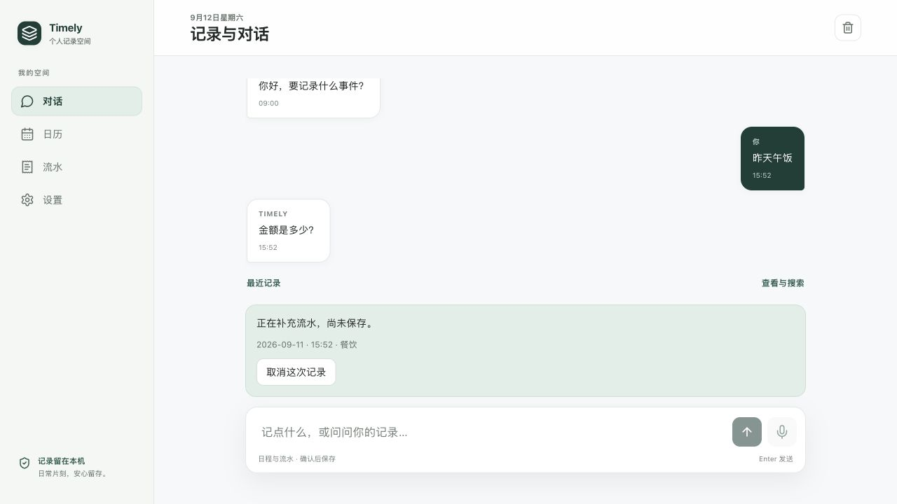
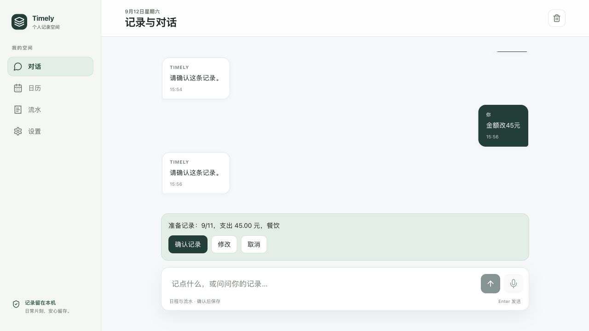
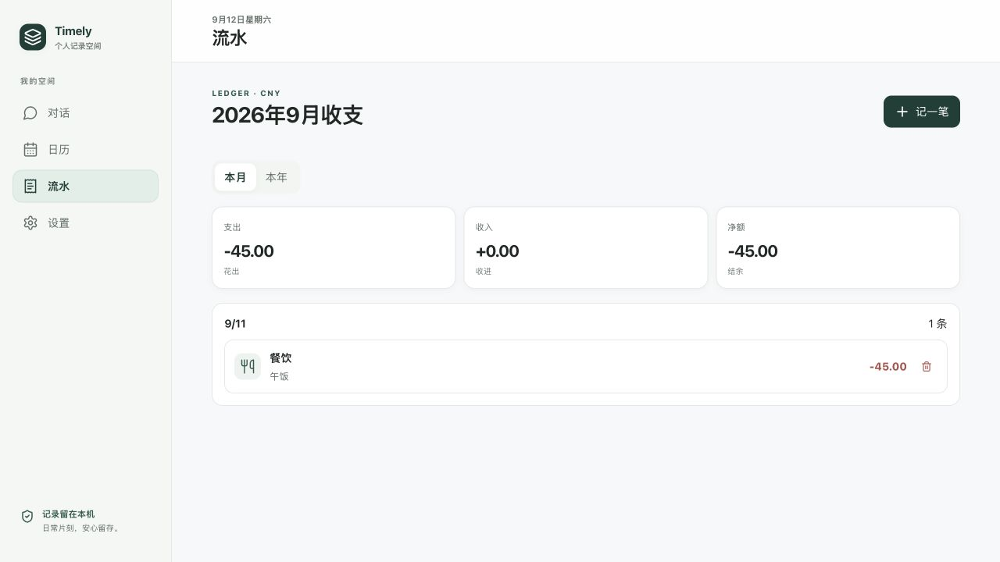

# 三分钟端到端演示

2026-09-12 使用本地 Next 应用、真实 DeepSeek 接口与合成输入操作。截图为实际 1280×720 浏览器页面，没有使用静态预览或伪造响应。演示运行在本地未提交的纠错版本上；仅证明本次流程，不保证每次模型输出一致。

## 演示主线

1. 输入“昨天午饭”。本次返回“金额是多少？”，草稿显示日期与餐饮，尚未保存。
2. 输入“花35元”。出现 9/11、支出35元、餐饮的确认预览。
3. 确认前输入“金额改45元”。预览金额变为45元，日期仍为9/11。
4. 点击“确认记录”。收到已记录提示。
5. 打开“流水”。9/11 下仅一条餐饮记录，备注午饭，金额 -45.00。

这段演示说明：缺失字段可以补充；改金额不应丢日期；预览与保存有明确边界；结果可以查回。它不证明用户一定觉得方便，也不衡量整体模型准确率。

### 追问：保留原意，尚未保存

### 纠正：确认前更新金额

### 保存：流水中查回一条正确记录

## 在自己的电脑复现

按 [README](../../README.md) 配置并启动。使用专门的浏览器资料或空白站点存储环境，避免演示记录与个人数据混在一起；无需清空已有私人数据。初始应用可能带示例日程，本段只观察新增流水。

日期随运行当天变化，“昨天”应等于 Asia/Shanghai 的前一天。金额在确认前可修改，确认后进入流水页核对日期和条数。若已有相同记录，按界面的重复提示处理，不将额外旧记录当成本次重复写入。

如果模型追问类型不同，照实保留过程；出现失败时展示恢复/重试，不暗中更换响应或将本地 fallback 冒充模型成功。只用合成输入；API 解析会发送输入及待处理上下文到模型服务。

## 讲解稿

“我先说昨天午饭，故意漏掉金额。系统保留日期，问金额。补充后先显示预览，我发现金额错了，直接改成45元，再确认保存。流水中可以看到只有一条正确记录。这个产品要解决的不只是一次解析，而是信息不完整或被纠正后，仍然能得到用户认可的记录。”

接着打开[产品案例](case-study.md)说明一次失败如何影响设计，再打开[评测索引](evidence.md)展示仍未通过的结果与限制。
